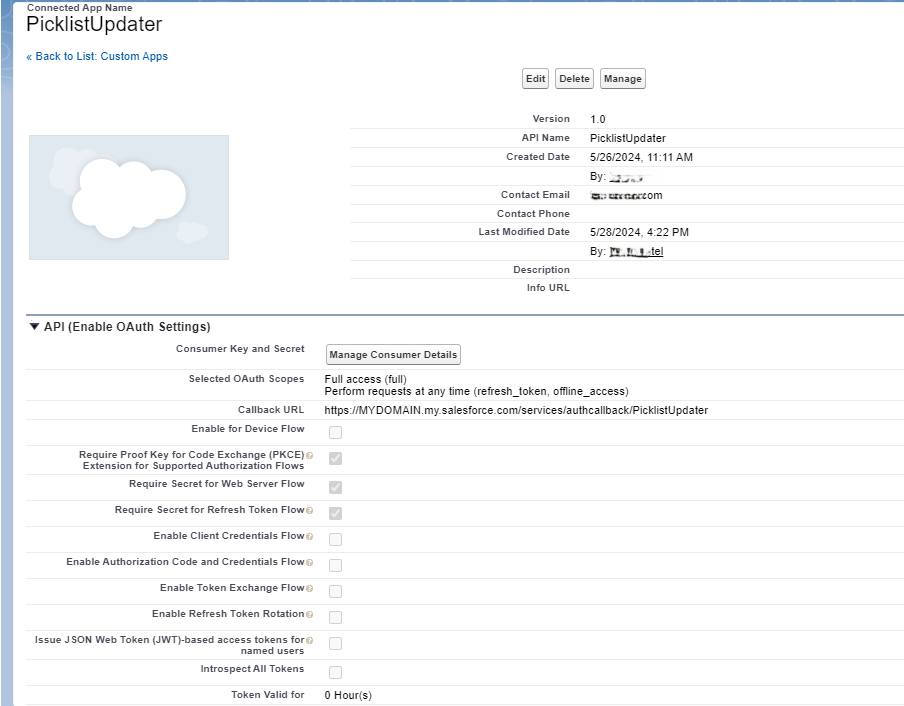
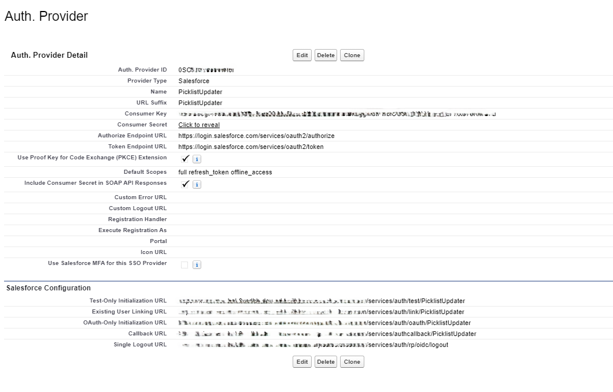
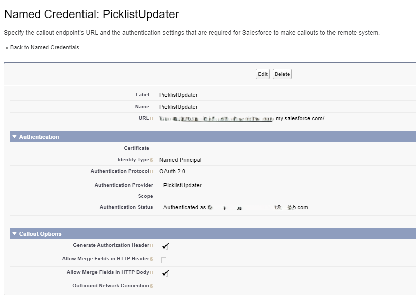
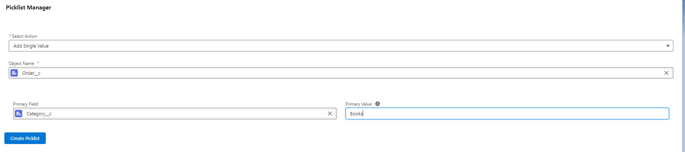
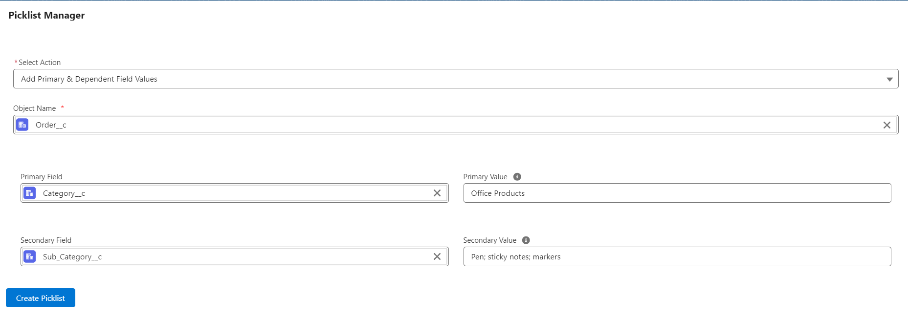

# Picklist Manager App for Salesforce

The Picklist Manager App is a versatile Salesforce application designed to facilitate the management of custom picklists. It enables users, including non-admins, to easily add new values to dropdowns and create dependencies between them.

## Features

- **Non-admin Access**: Allows non-administrative users to add values to picklists.
- **Dependent Picklists**: Users can add primary and dependent values to create a structured data entry flow.

## Setup

### Deployment

1. **Deploy code** to your Salesforce instance.  
   
2. **Add the Picklist Manager tab** to your Salesforce application.
3. **Provide necessary access** at the profile level for the Picklist Manager.
4. **Grant access** to the Picklist Updater object and field for necessary profiles.
5. **Setup connected applications**:

   - **Create a connected app**, Auth Provider, and Named Credential as described below. Ensure the Named Credential is named 'PicklistUpdater'. If using a different name, update it accordingly in necessary files.

   1. **App Manager**:

      - Go to Setup > App Manager > New Connected App.
      - Name: PicklistUpdater
      - Contact Email: [Your Preferred Email]
      - Callback URL: Update later after setting up Auth Provider.
      - Selected Scope: Full access (full), Perform requests anytime (refresh_token, offline_access)
      - Security Settings: Check all required options including PKCE and secret requirements.
      - Save the app and manage consumer details.
      - **Copy the consumer key and secret** for later use.  
        

   2. **Auth. Providers**:

      - Setup > Auth. Providers > New
      - Provider Type: Salesforce
      - Name: PicklistUpdater
      - Consumer Key and Secret: Paste the ones copied from Connected App.
      - Authorized and Token Endpoint URLs as specified.
      - Default Scopes: full, refresh_token, offline_access
      - Save and copy the Callback URL to Connected App.  
        

   3. **Named Credentials**:
      - Setup > Named Credentials > New
      - Label/Name: PicklistUpdater
      - URL: [Your Salesforce domain URL]
      - Identity Type: Named Principal
      - Authentication Protocol: OAuth 2.0
      - Authentication Provider: PicklistUpdater
      - Scope: full, refresh_token, offline_access
      - Start Authentication on save and configure headers.
      - **Complete the authentication** by logging in with an admin-level user.  
        

## Usage

Open the **Picklist Manager** tab and select an action:

- **Add Single Value**: Add a value to an existing custom picklist field.  
  

- **Add Primary & Dependent Field Values**: Add a primary (parent) value and secondary (child) values separated by semicolons (value1; value2; etc.).  
  

- **Deactivate Value**: Deactivate a value from an existing custom picklist field.
- **Update Dependency Only**: Create dependencies between existing primary and secondary values.

## Records Management

- The app includes a **Picklist Manager Records** table to store and display all modifications to picklist values.

## Technology Used

- **Apex**
- **Lightning Web Components (LWC)**
- **CSS**

## License

This project is licensed under the MIT License - see the LICENSE.md file for details.

## References

This project uses components or code from the following repositories:

- [Apex-mdapi](https://github.com/certinia/apex-mdapi)
- [Salesforce Lightning Design System (SLDS)](https://github.com/salesforce-ux/design-system)
