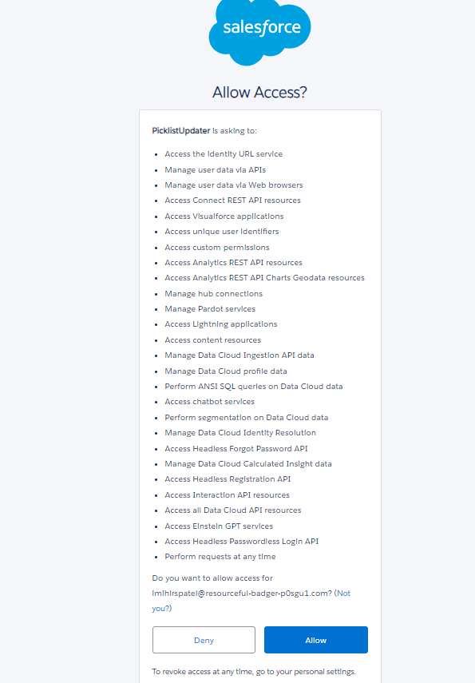
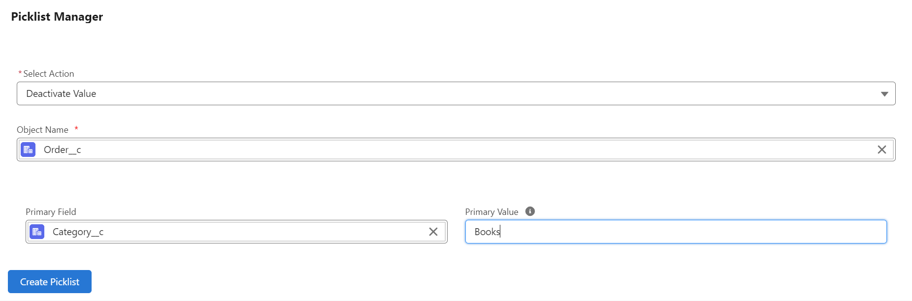
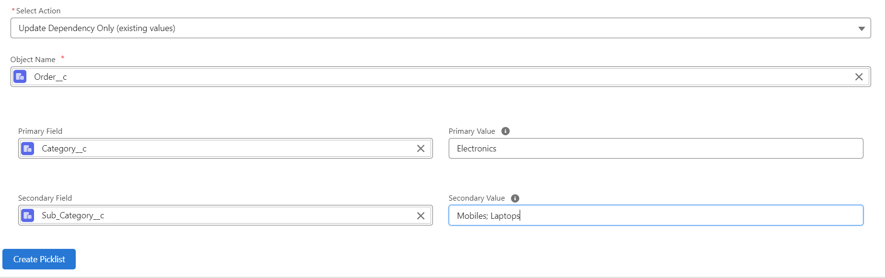
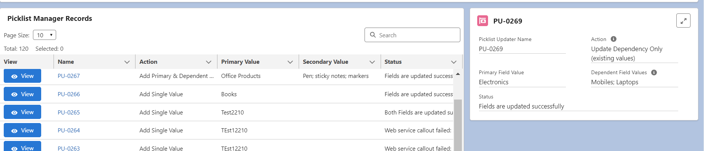

# Picklist Manager App for Salesforce

Currently, Salesforce does not allow non-admin users to add or remove picklist values without granting them extensive permissions to modify the entire application, which is often not an ideal solution. The Picklist Manager App addresses this challenge. Designed using Apex and LWC, this Salesforce app enables non-admin users to manage custom picklist values efficiently. The app simplifies the process, which is among the most common and time-consuming requests for admins, by allowing non-admins to update picklist values easily.

## Features

- **Non-admin Access**: Allows non-admin users to add values to picklists field. Since 
- **Dependent Picklists**: Users can update dependent values, which is often time-consuming when using the UI for large picklists

## Setup

### Deployment

1. **Deploy code** to your Salesforce instance.  
   
2. **Add the Picklist Manager tab to your Salesforce application.**
3. **Provide necessary access at the profile level for the Picklist Manager.**
4. **Grant access to the Picklist Updater object and field for necessary profiles.** (_this object stores requests made in Picklist Manager_)
5. **Setup connected applications**:
   - **Create a connected app, Auth Provider, and Named Credential** as described below. (_Use 'PicklistUpdater' as the name for Named Credentials. If using a different name, add a new name in PicklistFieldUPdater.cls and MetadataService.cls._)

   1. **App Manager**:

      - Go to Setup > App Manager > New Connected App.
      - Name: PicklistUpdater
      - Contact Email: [Your Preferred Email]
      - Callback URL: _Update later after setting up Auth Provider._
      - Selected Scope: Full access (full), Perform requests anytime (refresh_token, offline_access)
      - Security Settings: Check all required options including PKCE and secret requirements. (_see below image for reference_)
      - Save the app and click on the Manage Consumer Details.
      - **Copy the consumer key and secret** for later use.  
        

   2. **Auth. Providers**:

      - Setup > Auth. Providers > New
      - Provider Type: Salesforce
      - Name: PicklistUpdater
      - URL Suffix: PicklistUpdater
      - Consumer Key and Secret: Paste the ones copied from Connected App.
      - Authorized Endpoint URL: https://login.salesforce.com/services/oauth2/authorize
      - Authorized Token URL: https://login.salesforce.com/services/oauth2/token
      - Use Proof Key for Code Exchange (PKCE) Extension: Checked
      - Default Scopes: full refresh_token offline_access
      - Include Consumer Secret in SOAP API Responses: Checked 
      - Save 
      - Copy the **Callback URL** and add it in Connected App.  
        

   3. **Named Credentials**:
      - Setup > Named Credentials > New
      - Label/Name: PicklistUpdater
      - URL: [Your Salesforce domain URL]
      - Identity Type: Named Principal
      - Authentication Protocol: OAuth 2.0
      - Authentication Provider: PicklistUpdater
      - Scope: full refresh_token offline_access
      - Start Authentication on save: Checked
      - Generate Authorization Header: Checked
      - Allow Merge Fields in HTTP Body: Checked
        
         
      - **Complete the authentication** by logging in with an admin-level user. 
         

## Usage

Open the **Picklist Manager** tab and select an action:

- **Add Single Value**: Add a new value to an existing custom picklist field.  
  

- **Add Primary & Dependent Field Values**: Add a new value primary (parent) and secondary (dependent) picklists at the same time. Multiple secondary (dependent) values can be added. Each value is separated by semicolons (value1; value2; etc.).  
  

- **Deactivate Value**: Deactivate a value from a custom picklist field.
 

- **Update Dependency Only**: Create dependencies between existing primary (parent) and secondary (dependent) picklists.

## Records Management

- The app also includes a **Picklist Manager Records** table to store and display all modifications to picklist values. Records are stored in Picklist Updater object. You can adjust OWS and FLS per your requirements.

## Technology Used

- **Apex**
- **Lightning Web Components (LWC)**
- **CSS**

## License

This project is licensed under the MIT License - see the LICENSE.md file for details.

## References

This project uses components or code from the following repositories:

- [Apex-mdapi](https://github.com/certinia/apex-mdapi)
- [Salesforce Lightning Design System (SLDS)](https://github.com/salesforce-ux/design-system)
